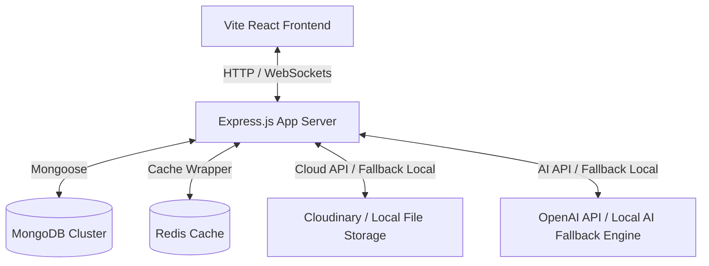

# 🌌 Trendora

> **An AI-powered, modern, and highly scalable social networking feed platform built using the MERN stack.**

[](https://react.dev/)
[](https://nodejs.org/)
[](https://www.mongodb.com/)
[](https://redis.io/)
[](./LICENSE)

---

## 📖 Introduction

Trendora is a next-generation social networking platform that combines traditional MERN stack architecture with advanced AI functionalities. From intelligent content moderation and sentiment/toxicity analysis to semantic smart search, dynamic caption generation, and hashtag velocity-based trend detection, Trendora offers a cutting-edge social experience.

A core tenet of Trendora's design is **portability and fault tolerance**. While it leverages premium APIs (OpenAI, Cloudinary, Redis), it is fully capable of running **100% offline** using advanced local fallbacks (regex content moderation, deterministic token-hashing search embeddings, and local filesystem uploads).

---

## ✨ Features

### 🧩 Core Social Features
* 🔐 **Secure Auth**: JWT access/refresh token rotation, bcrypt password hashing, and session management.
* 👤 **User Profiles**: Custom profiles, follow graphs, biographical details, and dynamic follow/unfollow updates.
* 📝 **Interactive Feed**: Post CRUD (with image support), likes, comments, and replies.
* 🔔 **Real-Time Notifications**: Instant user feedback for likes, comments, and new followers using **Socket.io**.

### 🧠 Artificial Intelligence Engine
* 🤖 **Smart Search**: Semantic vector search for posts and profiles (leveraging OpenAI embeddings, with deterministic unit-vector hash local fallback).
* 📝 **AI Caption Generator**: Automatic tag and category detection based on uploaded image metadata.
* 🛡️ **Content Moderation**: Dynamic content verification (auto-flags spam, links, toxic keywords, or negative sentiment, with a dedicated **Moderator Queue** dashboard).
* 📈 **Trend Detection**: Real-time trending topic and hashtag tracker using a velocity-based decay algorithm.
* 🔮 **Personalized Feed Recommendation**: Engagement-weighted feed calculation combining user history, follow graphs, and post interactions.

### 🔌 Fault-Tolerance & Hybrid Local Fallbacks
* **Database**: MongoDB (required) with connection pooling and automated reconnects.
* **Cache**: Redis. If Redis is unavailable, it gracefully redirects to a thread-safe in-memory cache wrapper.
* **Storage**: Cloudinary CDN. Automatically falls back to local file storage (`/uploads`) served statically if credentials are not configured.
* **AI/Embeddings**: OpenAI API. Automatically falls back to local token-hashing algorithms and regex/toxic-matrices classification.

---

## 🛠️ Tech Stack

### Frontend
* **React 19** — Single-page application build.
* **Vite** — High-speed modern bundler.
* **React Router 7** — Declared page navigation and route guarding.
* **Framer Motion** — Premium UI animations and page transitions.
* **Lucide React** — Crisp vector icons.
* **Socket.io Client** — Real-time event streams.
* **Tailwind CSS** — Fluid visual layout utility styles.

### Backend
* **Node.js & Express.js** — Robust API design pattern.
* **MongoDB + Mongoose** — Scalable indexing and modeling.
* **Socket.io** — Real-time notification socket server.
* **Redis** — Fast feed and metadata caching.
* **Winston** — Multi-transport logging (console + files with daily log rotation).
* **Multer / Multer-Cloudinary** — Seamless handling of multipart image uploads.
* **Nodemailer** — Verification and transactional mail services.

---

## 🏛️ System Architecture



### Request Lifecycle Flow
```
[Client App] --> [Rate Limiter Middleware] --> [Helmet & CORS Headers]
                    ↓
        [JWT / Session Authenticator]
                    ↓
        [Request Validator (express-validator)]
                    ↓
        [Router] --> [Controller] --> [AI Fallback / External Services]
                                          ↓
                                  [Service Layer (Business Logic)]
                                          ↓
                                  [MongoDB / Redis Cache]
```

---

## 📁 Repository Directory Structure

```
Trendora/
├── backend/                       # Node.js/Express.js Backend Server
│   ├── config/                    # Server environments, databases, constants
│   ├── controllers/               # Express request/response logic
│   ├── logs/                      # Winston automatic logs directory
│   ├── middlewares/               # Auth, validation, errors, security
│   ├── models/                    # Mongoose schemas (User, Post, Comment, etc.)
│   ├── routes/                    # API endpoints routes
│   ├── services/                  # Business logic & AI/Socket services
│   ├── tests/                     # Jest & Supertest integration suite
│   ├── utils/                     # Formatters, loggers, validation helpers
│   ├── app.js                     # Express configuration
│   ├── server.js                  # Primary application entry point
│   └── package.json
│
├── frontend/                      # React 19 Frontend Client
│   ├── src/
│   │   ├── components/            # Reusable components & guards (Auth/Guest)
│   │   ├── context/               # React Auth & Notifications context states
│   │   ├── pages/                 # Routing endpoints (Home, Profile, Moderation...)
│   │   ├── utils/                 # Frontend helpers (Axios config)
│   │   ├── App.jsx                # Layout definitions and Router wrapper
│   │   └── main.jsx               # Client initialization
│   ├── vite.config.js             # Vite configuration
│   └── package.json
│
├── docs/                          # Project Phase Summaries and Manuals
│   ├── API_SPECIFICATION.md       # Full REST API mapping (30+ endpoints)
│   ├── ARCHITECTURE.md            # In-depth architectural layout
│   └── GETTING_STARTED.md         # Comprehensive setup instructions
│
├── package.json                   # Unified root monorepo scripts config
└── README.md                      # Project documentation (You are here)
```

---

## 🚀 Getting Started

### Prerequisites
* **Node.js** `>= 16.0.0`
* **npm** `>= 8.0.0`
* **MongoDB** (local server running or MongoDB Atlas connection URI)
* **Redis** (Optional: local Redis instance running)

### Installation & Run

1. **Clone the repository:**
   ```bash
   git clone <repo-url>
   cd Trendora
   ```

2. **Quick Start (One-Click Dev Server):**
   Install all dependencies (frontend + backend) and run development instances concurrently:
   ```bash
   npm run build
   npm run dev
   ```
   * The **Frontend** client will be served at: `http://localhost:5173`
   * The **Backend** API will start at: `http://localhost:5000`

### Individual Running Instructions

If you prefer to run services individually:

* **Backend Dev Server**:
  ```bash
  npm run backend
  ```
* **Frontend Dev Server**:
  ```bash
  npm run frontend
  ```

---

## ⚙️ Environment Variables

Copy the templates in `backend/.env.example` and `frontend/.env.example` to create your own configuration.

### Backend Configurations (`backend/.env`)

| Variable | Description | Recommended/Default |
|---|---|---|
| `PORT` | Local express backend port | `5000` |
| `MONGODB_URI` | MongoDB Connection URI | `mongodb://localhost:27017/trendora` |
| `MONGODB_TEST_URI` | Database name for Jest testing | `mongodb://localhost:27017/trendora_test` |
| `JWT_SECRET` | Secret key for access token signing | Minimum 32-character custom string |
| `JWT_REFRESH_SECRET`| Secret key for refresh tokens | Minimum 32-character custom string |
| `REDIS_URL` | Connection URL for Redis instances | `redis://localhost:6379` |
| `OPENAI_API_KEY` | OpenAI API integration | `sk-local-mock-key-for-development` *(triggers local fallbacks)* |
| `CLOUDINARY_CLOUD_NAME`| Cloudinary Cloud Name | Leave blank to use local `/uploads` directory |
| `CLOUDINARY_API_KEY` | Cloudinary API Key | Leave blank to use local `/uploads` directory |
| `CLOUDINARY_API_SECRET`| Cloudinary API Secret | Leave blank to use local `/uploads` directory |

---

## 🧪 Automated Testing

Trendora is equipped with comprehensive integration testing using Jest and Supertest.

> [!IMPORTANT]
> Because Jest runs tests concurrently by default, concurrent database cleanups can corrupt shared tables. Ensure you run test suites **serially** using the `--runInBand` flag.

Run the test suite using:
```bash
# Navigate to backend and run tests serially
cd backend
npm test -- --runInBand --forceExit
```

The test suite covers:
* `aiCaption.test.js` — Checks category detection from filenames.
* `aiService.test.js` — Validates local vector search & cosine similarities.
* `moderation.test.js` — Evaluates auto-routing of toxic posts to the moderation queue.
* `search.test.js` — Tests semantic queries, history tracking, and keyword boosting.
* `trend.test.js` — Checks time-decay metrics on trending hashtag velocities.

---

## 📚 API Endpoints Overview

The complete API specification is available in **[API_SPECIFICATION.md](./docs/API_SPECIFICATION.md)**. Below is a quick summary:

### 🔑 Authentication (`/api/auth`)
* `POST /register` — Register a new account
* `POST /login` — Log in and retrieve tokens
* `POST /refresh` — Refresh access token rotation
* `POST /logout` — Invalidate access and refresh tokens

### 📝 Posts (`/api/posts`)
* `POST /` — Create a post (accepts image/multipart)
* `GET /` — Get a personalized feed
* `GET /explore` — Get latest public posts
* `GET /trending` — Retrieve trending posts & topics
* `GET /:postId` — Detailed post lookups with nested comments
* `PUT /:postId` / `DELETE /:postId` — Edit or delete posts

### 👤 Profiles & Social Graph (`/api/users`)
* `GET /:username` — User profiles details
* `PUT /profile` — Edit profile details
* `POST /:userId/follow` — Follow or unfollow a user

### 🛡️ Moderation (`/api/moderation`)
* `GET /` — (Moderator only) List flagged/moderated posts
* `POST /:postId/action` — Approve, decline, or quarantine flagged content

---

## 🤝 Contributing

We welcome contributions to Trendora! To contribute:
1. Review the roadmap details in **[PROJECT_PHASES.md](./docs/PROJECT_PHASES.md)**.
2. Ensure you format all contributions according to the existing ESLint guidelines (`npm run lint`).
3. Always verify changes with the local test suite prior to submitting pull requests.

---

## 📄 License

This project is licensed under the MIT License. See the LICENSE file for details.

---

**Developed with ❤️ and AI for modern social platforms. Let's build something amazing! 🚀**
